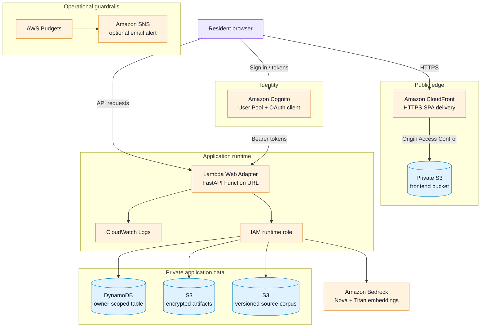

# CivitasX

## What we are making

CivitasX is a local-first civic network for Bengaluru residents. It combines a public civic issue feed with a private, Hermes-style agent that helps people research official records, understand evidence, prepare complaint drafts, and track what happens next.

## AWS architecture

The Phase 2 AWS boundary is defined in [`infra/template.yaml`](infra/template.yaml):

The frontend bucket, artifacts bucket, and source-corpus bucket remain private. The application uses Cognito for production identity, DynamoDB for owner-scoped state, S3 for artifacts and versioned source documents, and Bedrock only when the configured cloud provider is enabled.

## What we intend to achieve

We intend to make civic information easier to understand and act on while keeping evidence grounded, personal work private, and every public or external action reviewable. The project aims to grow into a trustworthy civic workspace where residents can move from a question to a clear, accountable next step.
